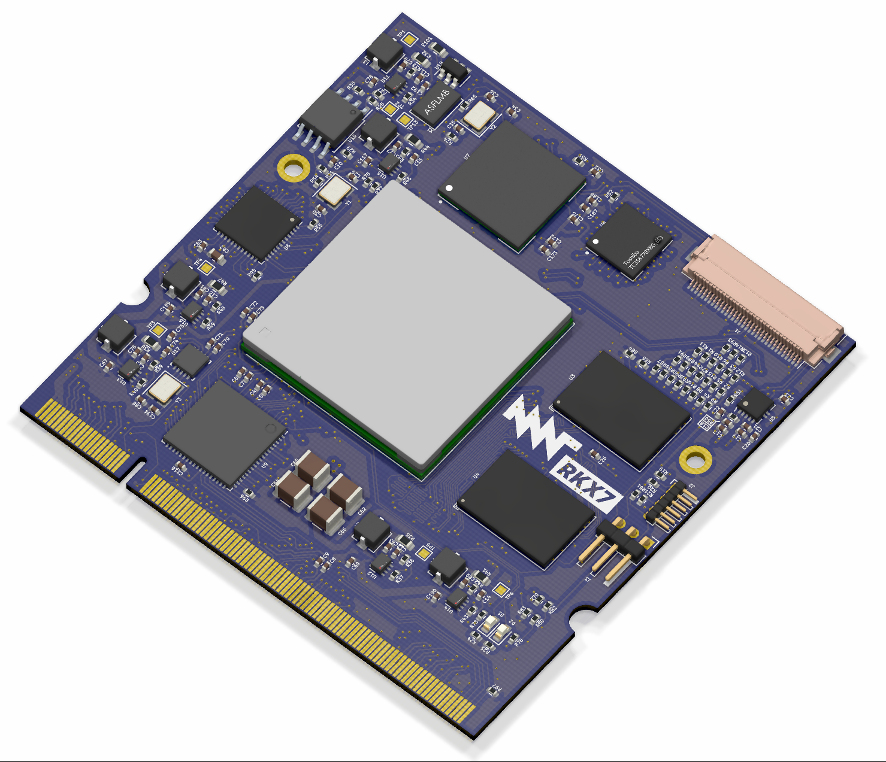

# MNT Reform Kintex-7 SoM (MNT RKX7)

This is the open hardware system-on-module featuring the Xilinx Kintex-7 FPGA and 2GB DDR3 RAM. It can be used as an alternative to the main processor module in the [MNT Reform open hardware laptop](https://www.crowdsupply.com/mnt/reform) or in any other custom device. The idea is to test synthesized open cores such as Ariane (RISC-V) or LibreSOC (OpenPOWER) in a real laptop. True emulation of vintage computer architectures in a laptop form factor is possible as well.

The module was designed by Lukas F. Hartmann (mntmn) of [MNT Research GmbH](https://mntre.com).

## Status

The initial design of the module is complete and we are now in the bringup phase. It is likely that there are further iterations necessary. Proceed with caution.

The design is made with [KiCAD, a free and open source EDA program](https://www.kicad.org/).

## Specs

- FPGA: [Xilinx Kintex-7](https://www.xilinx.com/products/silicon-devices/fpga/kintex-7.html) XC7K160T-FFG676 or pin-compatible family members.
- Memory: 2GB DDR3 (2x Micron IS43TR16512B-125KBLI in 32-bit topology)
- 100 Mhz main clock oscillator
- 1x USB3 + 1x USB2 implemented via parallel data pipes to TUSB1310ZAY transceiver
- 4-lane MIPI-DSI implemented via TC358778XBG encoder (available on 33-pin FPC)
- HDMI 1.4 (Full HD) implemented via Sii9022 encoder
- 1 GBit Ethernet via KSZ9031RNX PHY
- 2x PCIe lanes connected to GTX transceivers
- 1x USB3 connected to GTX transceiver
- 3x UART, 2x I2C, 1x SAI, 1x PWM backlight ports connected to FPGA fabric
- 128 MBit configuration flash (Winbond W25Q128JVSIM)
- JTAG header
- 6 synchronous buck converters powered by single 5V input, power consumption not yet measured
- Size: 68x67.5mm, 200 pin SO-DIMM card edge (mates with TE 1717254-1 or TE 1473005-1)
- Schematics: [PDF](reform-kintex-schematics.pdf)

## Copyright

All hardware design work in this repository is © 2021 [MNT Research GmbH](https://mntre.com), Berlin, Germany.

## License

All hardware sources are licensed under the [CERN Open Hardware Licence Version 2 - Strongly Reciprocal](https://ohwr.org/project/cernohl/wikis/uploads/002d0b7d5066e6b3829168730237bddb/cern_ohl_s_v2.txt).

## Funding

This project [is made possible through funding by NLNet](https://nlnet.nl/project/MNT-Reform/). Thanks!
