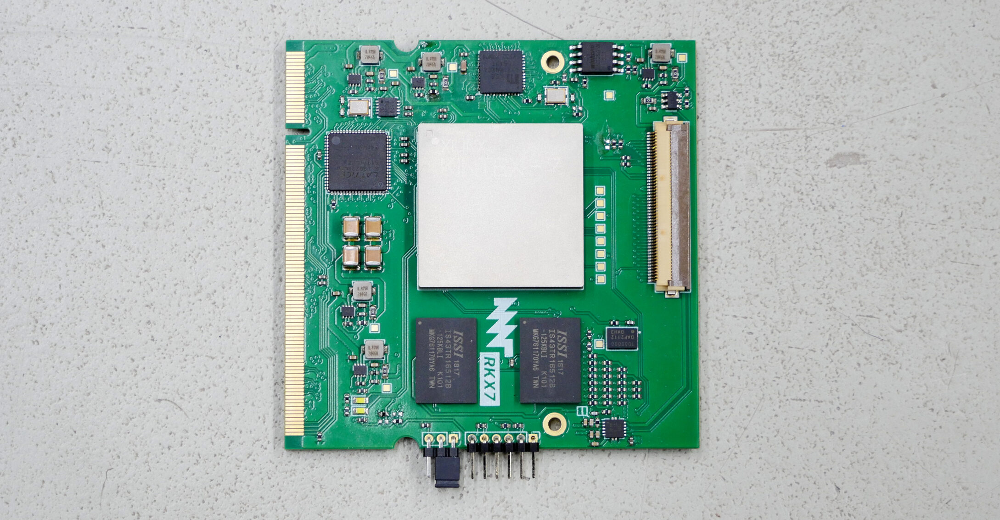
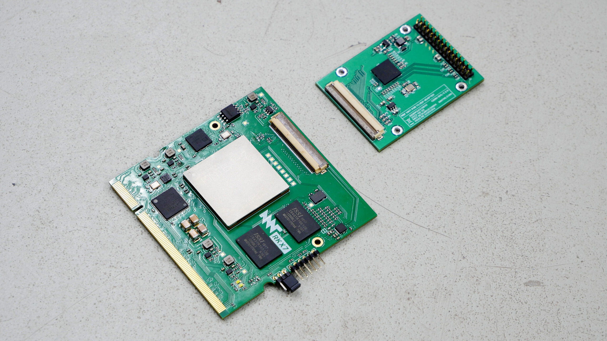

# MNT Reform Kintex-7 SoM (MNT RKX7)

This is the open hardware system-on-module featuring the Xilinx/AMD Kintex-7 FPGA (XC7K160T or XC7K325T) and 2GB DDR3 RAM. It can be used as an alternative to the main processor module in the [MNT Reform open hardware laptop](https://www.crowdsupply.com/mnt/reform) or in any other custom device. The idea is to test synthesized open cores such as [CORE-V CVA6](https://github.com/openhwgroup/cva6) (RISC-V), [LiteX](https://github.com/enjoy-digital/litex) (multi-architecture), [LibreSOC](https://libre-soc.org/) (OpenPOWER) in a real laptop. True emulation of vintage computer architectures in a laptop form factor is possible as well.

The module was designed by Lukas F. Hartmann (mntmn) of [MNT Research GmbH](https://mntre.com).

## Status

In September 2022 we assembled and brought up the second revision of the module (D-2) which fixes some problems found in the first revision. We were able to run a full RISC-V Linux desktop on the new module, integrated in the MNT Reform laptop shell. We are using the XC7K325T-FFG676 FPGA. For details, see [the MNT Reform Kintex-7 SoM Showcase](https://mntre.com/media/reform_md/2022-09-29-rkx7-showcase.html).

Changes from D-1:

- The power sequencing IC was missing pullups on the outputs.
- The DDR3 memory routing was completely redone for a less congested layout and avoiding crosstalk. This fixed some address bus errors of the first version.
- The TC358778XBG MIPI encoder was removed. Instead, 24-bit parallel RGB, clocks and extra GPIOs are routed out to a new 50 pin FPC header. This makes the module more flexibly usable.
- We designed a new adapter PCB featuring the Analogix ANX9807 RGB to eDP chip. We are able to successfully drive MNT Reform's eDP Full HD display.
- The TUSB1310ZAY USB3/2 PHY was removed as it is EOL, expensive and there was is no available XHCI host implementation that could drive it. Instead, USB1/2 pads are now driven directly by the FPGA. This works well with the SpinalHDL OHCI host controller which is supported by LiteX.
- 8 FPGA additional pads were broken out to an array of square test points.
- The JTAG header pitch was increased to 2mm for easier access.

The design was created using [KiCAD, a free and open source EDA program](https://www.kicad.org/).

## Specs

- FPGA: [Xilinx Kintex-7](https://www.xilinx.com/products/silicon-devices/fpga/kintex-7.html) XC7K160T-FFG676 or pin-compatible family members. We are using XC7K325T-FFG676 in our tests.
- Memory: 2GB DDR3 (2x Micron IS43TR16512B-125KBLI in 32-bit topology)
- 100 MHz main clock oscillator
- HDMI 1.4 (Full HD) implemented via Sii9022 encoder
- 1 GBit Ethernet via KSZ9031RNX PHY
- 2x PCIe lanes connected to GTX transceivers
- 1x USB3 connected to GTX transceiver
- 3x UART, 2x I2C, 1x SAI, 1x PWM backlight ports connected to FPGA fabric
- 128 MBit configuration flash (Winbond W25Q128JVSIM)
- JTAG header
- 6 synchronous buck converters powered by single 5V input
- Size: 68x67.5mm, 200 pin SO-DIMM card edge (mates with TE 1717254-1 or TE 1473005-1)
- Schematics: [PDF](reform-kintex-schematics.pdf)

## Copyright

All hardware design work in this repository is © 2021-2022 [MNT Research GmbH](https://mntre.com), Berlin, Germany.

## License

All hardware sources are licensed under the [CERN Open Hardware Licence Version 2 - Strongly Reciprocal](https://ohwr.org/project/cernohl/wikis/uploads/002d0b7d5066e6b3829168730237bddb/cern_ohl_s_v2.txt).

## Funding

This project [is made possible through funding by NLNet](https://nlnet.nl/project/MNT-Reform/). Thanks!
